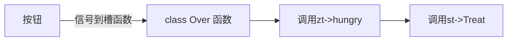
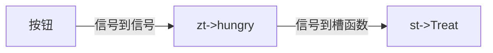

---
title:Qt学习
---

# day1

QWidget 是 QmainWindow和Qdialog的父类

* Qwidget为空窗口
* Qmainwindow多了菜单栏,状态栏
* Qdialog有一些对话框

## Qt.pro文件

* ```cpp
  QT       += core gui   Qt包含的模块，此处为图像界面模块
  ```


```cpp
greaterThan(QT_MAJOR_VERSION, 4): QT += widgets //大于4版本以上多余widgets模块
TARGET = 01day	//生成exe文件的名称
TEMPLATE = app	//模板：应用程序模板
    

SOURCES += \
        main.cpp \
        widget.cpp	//源文件

HEADERS += \
        widget.h	//头文件
```


## 按钮和窗口

```cpp
    //创建一个按钮
    QPushButton * p= new QPushButton;
    p->show();  //以顶层的方式弹出
    p->setParent(this); //让p随着父类指针显示
    p->setText("第一个按钮");

    //创建第二个按钮,父类直接传入
    QPushButton *btn2= new QPushButton("第二个按钮",this);
    btn2->move(100,100);    //移动到100,100的位置

	//按钮指定大小
    btn2->resize(100,100);


    //重置窗口大小
    resize(600,400);


    //设置固定的窗口大小
    setFixedSize(600,400);

    //设置窗口的标题
    setWindowTitle("第一个窗口");
```

## 对象树

* Qobject派生的类，可以将子类对象挂在树上，可以不用管理释放的操作，他会自动放入对象树上，简化了内存回收机制

* 窗口坐标系，左上角是(0,0)，X向右增加，Y向下增加

## 信号和槽

```cpp
connect(信号的发送者，发送的信号，信号的接受者，信号的处理（槽函数）)
```

信号槽的优点：松散耦合，信号发生和接受端没有关系，通过connect连接

* 创建类的时候可以继承Qobject，这样可以不用管内存回收


信号要创建在类的`signals`里面

```cpp
signals:
    //自定义信号
    //返回值是void，只需要声明，不需要实现
    //可以有参数，可以重载
    void hungry();
```


槽函数创建再`slots`里面

```cpp
public slots:
    //Slots函数可以写在这里
    //返回值是void，需要声明，需要实现，可以有参数，可以重载

    void Treat();

...Treat实现
```


```cpp
//自定义信号和槽
//teacher 类
//student 类
//需求：下课后，老师说饿了，学生请客吃饭

    //创建老师对象
    zt= new Teacher(this);//指明他们的父亲


    //创建学生对象
    st = new Student(this);

    //老师饿了，学生请客
    connect(zt,&Teacher::hungry,st,&Student::Treat);
    classover();
    classover2();
    //也就是说，以后再调用zt的hungry的同时，自动调用student::treat
    //为什么要传入对象？信号和槽机制主要是想知道是谁调用的，谁回答的
void SingleSlot::classover()
{
    zt->hungry();
}
```

### 自定义信号和槽

实现函数重载,其中重载函数的调用方式因为会产生二义性,那么需要我们对函数使用指针进行指定

```cpp
//定义一个指向函数的指针
void(Student::*Studentslot)(QString)=&Student::Treat;
void(Teacher::*teachersignal)(QString)=&Teacher::hungry;

connect(zt,teachersignal,st,Studentslot);
zt->hungry("宫保鸡丁");
//上面的"宫保鸡丁"也会被传入Studentslot
```


QString 转char *

先转QbyteArray（toUtf8Array()），再用data()


### 信号连接信号

* 方式一，信号连接窗口类的函数，然后再槽函数中调用其他对象的信号，利用对象和对象的槽函数连接，对其进行控制

```cpp
    //点击按钮，触发下课、调用classover ，然后在classover中调用zt->hungry("宫保鸡丁");
    connect(btn1,&QPushButton::clicked,this,&SingleSlot::classover);
```




* 将信号和信号相连接，将信号当作槽来使用

```cpp
    //信号连接信号
    connect(btn2,&QPushButton::clicked,zt,zt1); //zt1 是zt->hungry的指针
```

思考分析



*  断开信号

`disconnect`

* 信号可以连接多个槽
* 槽函数可以被多个信号连接,但是参数要对应

*  信号和槽一一对应

信号是有参的,那么槽函数也要是有参的

```cpp
    void (Student::* st1)(void)=&Student::Treat;
    void (Teacher:: *zt1)(void)=&Teacher::hungry;
```

上面这个可以连接

```cpp
    void(Teacher::*teachersignal)(QString)=&Teacher::hungry;//需要函数作用域Teacher
    void (Teacher:: *zt1)(void)=&Teacher::hungry;
```

下面这个不可连接,因为他们一个是`QString`,一个是`void`

* 信号函数参数的个数可以多余槽函数的参数的个数,但是类型也要一一对应

<font color='red'>信号的参数个数不能少于槽函数的类型个数,这个机制决定clicked函数了当有参构造的时候,必须使用函数调用的方法</font>

```cpp
QPushButton 函数clicked()无法连接带参槽函数
```

## lamabda表达式

语法结构

```cpp
[=]()//值传递,所有局部遍历都是赋值传递"="值传递,"&"引用传递
{
        btn1->setText("nihao");
}();//这里的小括号是调用
```

```cpp
[btn1]()//当中括号是某一个变量的时候,只会值传递该值,其他变量的值不可见
{
    btn1->setText("nihao");
    btn2->setText("nihao");	//报错,看不到btn2
}();
```

`mutable`

```cpp
int m=10;
connect(btn1,&QPushButton::clicked,this,[m]()mutable{m++;qDebug()<<m;});
connect(btn1,&QPushButton::clicked,this,[m](){m++;qDebug()<<m;});//非法
```

如上面加上mutable函数之后,可以修改<font color='red'> m的拷贝</font>,本身没有变


* 函数返回值,在小括号后面加上`->返回类型` 

```cpp
[btn1]()->int
{
	int m=100;
    return m;
}();
```

lambda表达式作为槽函数的时候可以省略第三个参数`this`

# day2

## 窗口设计

创建QmainWindow的类模板

### 菜单栏

```cpp
//创建菜单栏
QMenuBar *menu1= menuBar();
```

类时setparent,放入窗口中

```cpp
//将菜单栏放入Mainwindows其中
setMenuBar(menu1);
```

在菜单栏中添加一个菜单

```cpp
//创建一个菜单
QMenu * file= menu1->addMenu("你好");
QMenu * bianjie=menu1->addMenu("边界");

//创建菜单项目
file->addAction("编辑");
file->addAction("打开");


//添加分隔符
file->addSeparator();
file->addAction("打开1");
```


效果如上

### 工具栏

```cpp
//工具栏,可以有多个
QToolBar *tool=new QToolBar(this);

//放入窗口中,默认左边,查帮助文档
addToolBar(Qt::LeftToolBarArea,tool);

//只允许左右停靠
tool->setAllowedAreas(Qt::RightToolBarArea | Qt::RightToolBarArea);

//允许浮动
tool->setFloatable(true);


//设置移动,总开关,无论上面设置什么
tool->setMovable(false);
```

工具栏内容的设置

使用`addAction`方法

```cpp
//设置工具栏内容
tool->addAction("你好");
tool->addAction(open);
//添加分割线
tool->addSeparator();
tool->addAction(edit);
//添加控件:按钮
QPushButton * btn = new QPushButton("aa",this);
tool->addWidget(btn);

```

### 状态栏

```cpp
 //状态栏,只能有一个
QStatusBar * status= new QStatusBar(this);
setStatusBar(status);


//放标签的控件
QLabel * label =new QLabel("提示信息",this);
status->addWidget(label);

QLabel * label1 =new QLabel("右侧提示信息",this);
status->addPermanentWidget(label1);


//铆接固件,围绕着核心固件
QDockWidget * dock = new QDockWidget("浮动",this);
addDockWidget(Qt::LeftDockWidgetArea,dock);


//设置中心部件,
QTextEdit * edit1 = new QTextEdit(this);
setCentralWidget(edit1);
dock->setAllowedAreas(Qt::LeftDockWidgetArea|Qt::RightDockWidgetArea);
```

只允许有一个只能用`set`,否则只能用`add`

### 表格

```cpp
    ui->tableWidget->setColumnCount(3);
    //设置表头
    ui->tableWidget->setHorizontalHeaderLabels(QStringList()<<"姓名"<<"性别"<<"年龄");
    //设置行数
    ui->tableWidget->setRowCount(5);

    //设置正文
    QStringList nameList;
    nameList<<"亚瑟"<<"张飞"<<"关羽"<<"花木兰"<<"uz";

    //设置性别
    QList<QString> sexList;
    sexList<<"f"<<"m"<<"f"<<"f"<<"f";
    ui->tableWidget->setItem(0,0,new QTableWidgetItem("亚瑟"));
    for(int i=0;i<5;i++)
    {
        int col =0;
        ui->tableWidget->setItem(i,col++,new QTableWidgetItem(nameList[i]));
        ui->tableWidget->setItem(i,col++,new QTableWidgetItem(sexList.at(i)));
        ui->tableWidget->setItem(i,col++,new QTableWidgetItem(QString::number(i+18)));
    }

```


效果如图

